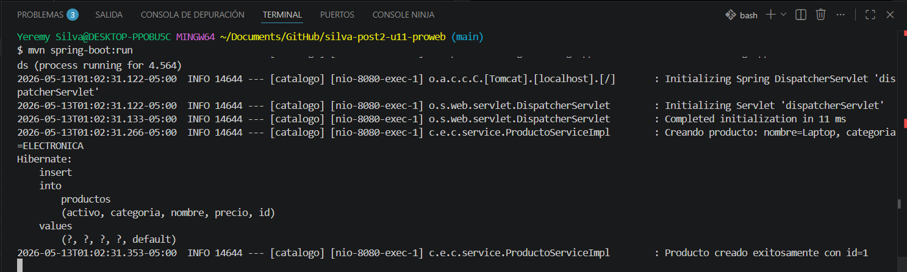
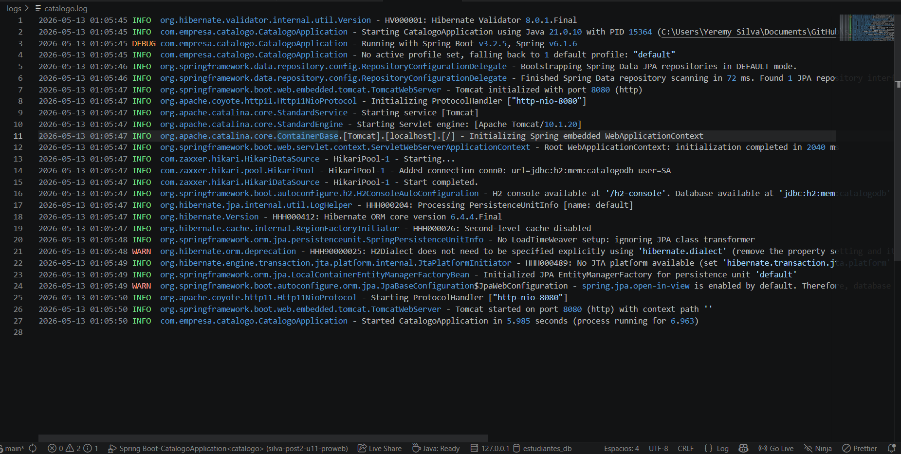
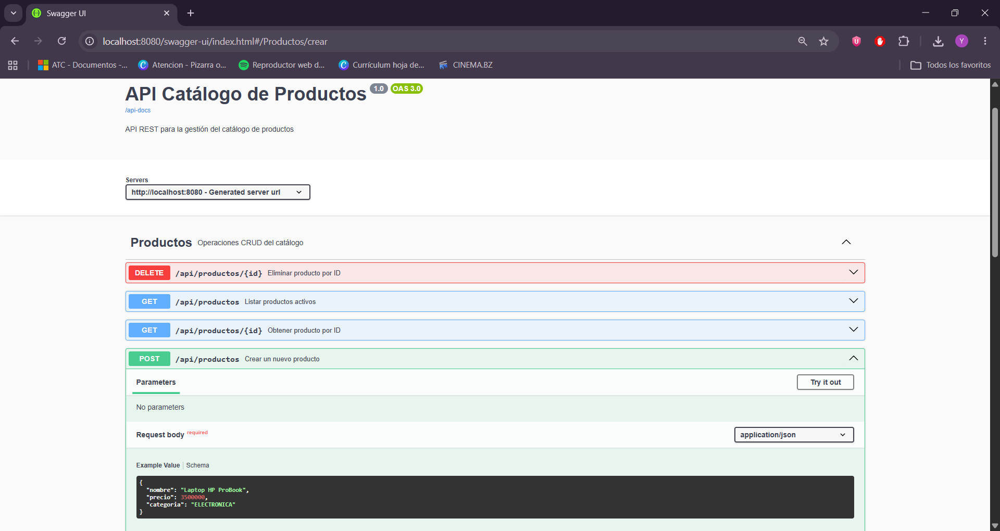

# Catálogo de Productos — Post-Contenido 2, Unidad 11

**Programación Web · Ingeniería de Sistemas · 2026**

API REST con Spring Boot 3 que integra **SLF4J / Logback** para logging estructurado y **Springdoc OpenAPI 2** para documentación interactiva de endpoints.

---

## Requisitos

- Java 17+
- Maven 3.9.x
- Navegador web (para Swagger UI)

---

## Ejecución

```bash
mvn spring-boot:run
```

La aplicación arranca en `http://localhost:8080`.

---

## Endpoints

| Método | URL | Descripción |
|--------|-----|-------------|
| `POST` | `/api/productos` | Crear un nuevo producto |
| `GET` | `/api/productos` | Listar productos activos |
| `GET` | `/api/productos/{id}` | Obtener producto por ID |
| `DELETE` | `/api/productos/{id}` | Eliminar un producto |

---

## Swagger UI

Disponible en: [http://localhost:8080/swagger-ui.html](http://localhost:8080/swagger-ui.html)

Endpoint OpenAPI JSON: [http://localhost:8080/api-docs](http://localhost:8080/api-docs)

---

## Logging

### Configuración

Archivo: `src/main/resources/logback-spring.xml`

- **CONSOLA**: Formato `HH:mm:ss %-5level %logger{30} - %msg%n`
- **ARCHIVO**: Rotación diaria, 30 días de historial, formato `yyyy-MM-dd HH:mm:ss %-5level %logger - %msg%n`
- Nivel global: `INFO`
- Paquete `com.empresa.catalogo`: `DEBUG`

### Ubicación de archivos de log

```
logs/catalogo.log         ← archivo activo
logs/catalogo.YYYY-MM-dd.log  ← archivos rotados (30 días)
```

> Nota: La carpeta `logs/` está incluida en `.gitignore` para no versionar los archivos de log.

---

## Evidencias

### Checkpoint 1 — Logs en consola con SLF4J

Al ejecutar operaciones CRUD, los mensajes aparecen en consola con el formato configurado. Se usan placeholders `{}`, niveles adecuados (INFO, DEBUG, WARN) y siempre incluyen el ID del recurso.



**Texto de consola capturado:**
```
01:23:48 INFO  c.e.c.s.ProductoServiceImpl - Creando producto: nombre=Laptop, categoria=ELECTRONICA
01:23:48 INFO  c.e.c.s.ProductoServiceImpl - Producto creado exitosamente con id=1
01:23:49 DEBUG c.e.c.s.ProductoServiceImpl - Buscando producto con id=1
01:23:49 DEBUG c.e.c.s.ProductoServiceImpl - Buscando producto con id=999
01:23:49 WARN  c.e.c.s.ProductoServiceImpl - Producto con id=999 no encontrado
01:23:49 INFO  c.e.c.s.ProductoServiceImpl - Eliminando producto con id=1
01:23:49 INFO  c.e.c.s.ProductoServiceImpl - Producto con id=1 eliminado correctamente
```

---

### Checkpoint 2 — Archivo de log en `logs/catalogo.log`

El archivo `logs/catalogo.log` se crea automáticamente al arrancar la aplicación. Contiene todos los mensajes con el formato de fecha completo `yyyy-MM-dd HH:mm:ss`.



**Contenido del archivo de log:**
```
2026-05-13 01:23:48 INFO  com.empresa.catalogo.service.ProductoServiceImpl - Creando producto: nombre=Laptop, categoria=ELECTRONICA
2026-05-13 01:23:48 INFO  com.empresa.catalogo.service.ProductoServiceImpl - Producto creado exitosamente con id=1
2026-05-13 01:23:49 DEBUG com.empresa.catalogo.service.ProductoServiceImpl - Buscando producto con id=1
2026-05-13 01:23:49 DEBUG com.empresa.catalogo.service.ProductoServiceImpl - Buscando producto con id=999
2026-05-13 01:23:49 WARN  com.empresa.catalogo.service.ProductoServiceImpl - Producto con id=999 no encontrado
2026-05-13 01:23:49 WARN  com.empresa.catalogo.exception.GlobalExceptionHandler - Recurso no encontrado: Producto con id 999 no encontrado.
2026-05-13 01:23:49 WARN  com.empresa.catalogo.exception.GlobalExceptionHandler - Validación fallida: nombre: El nombre es obligatorio
2026-05-13 01:23:49 INFO  com.empresa.catalogo.service.ProductoServiceImpl - Eliminando producto con id=1
2026-05-13 01:23:49 INFO  com.empresa.catalogo.service.ProductoServiceImpl - Producto con id=1 eliminado correctamente
```

---

### Checkpoint 3 — Swagger UI con endpoints documentados

Swagger UI muestra los 4 endpoints del catálogo con sus descripciones, parámetros y códigos de respuesta. El DTO `ProductoRequestDTO` incluye ejemplos concretos en las anotaciones `@Schema`.



**Resumen de la especificación OpenAPI:**
```
OpenAPI: 3.0.1
Title: API Catálogo de Productos
Version: 1.0
Description: API REST para la gestión del catálogo de productos

Tags:
  Productos: Operaciones CRUD del catálogo

Endpoints:
  GET    /api/productos       - Listar productos activos (200, 400, 404, 500)
  POST   /api/productos       - Crear un nuevo producto (201, 400, 404, 500)
  GET    /api/productos/{id}  - Obtener producto por ID (200, 400, 404, 500)
  DELETE /api/productos/{id}  - Eliminar producto por ID (204, 400, 404, 500)

Schemas:
  ProductoRequestDTO:
    nombre:    Nombre del producto (example: Laptop HP ProBook)
    precio:    Precio en pesos colombianos (example: 3500000.0)
    categoria: Categoría del producto (example: ELECTRONICA)
```

---

## Ejemplos con curl

```bash
# Crear producto (201)
curl -X POST http://localhost:8080/api/productos \
  -H "Content-Type: application/json" \
  -d '{"nombre":"Laptop","precio":3500000,"categoria":"ELECTRONICA"}'

# Listar activos (200)
curl http://localhost:8080/api/productos

# Buscar por ID (200)
curl http://localhost:8080/api/productos/1

# Buscar ID inexistente (404)
curl http://localhost:8080/api/productos/999

# POST con datos inválidos (400)
curl -X POST http://localhost:8080/api/productos \
  -H "Content-Type: application/json" \
  -d '{}'

# Eliminar producto (204)
curl -X DELETE http://localhost:8080/api/productos/1
```

---

## Estructura del proyecto

```
src/main/java/com/empresa/catalogo/
├── CatalogoApplication.java       ← @OpenAPIDefinition
├── controller/
│   └── ProductoController.java    ← @Tag, @Operation, @ApiResponse
├── service/
│   ├── ProductoService.java
│   └── ProductoServiceImpl.java   ← SLF4J Logger (INFO, DEBUG, WARN)
├── repository/
│   └── ProductoRepository.java
├── dto/
│   ├── ProductoRequestDTO.java    ← @Schema con ejemplos
│   └── ProductoResponseDTO.java
├── entity/
│   └── Producto.java
├── factory/
│   └── ProductoFactory.java
└── exception/
    ├── ApiError.java
    ├── EntityNotFoundException.java
    └── GlobalExceptionHandler.java ← SLF4J + @RestControllerAdvice(basePackages=...)

src/main/resources/
├── application.properties          ← springdoc.api-docs.path=/api-docs
└── logback-spring.xml              ← CONSOLA + ARCHIVO (RollingFileAppender)
```
